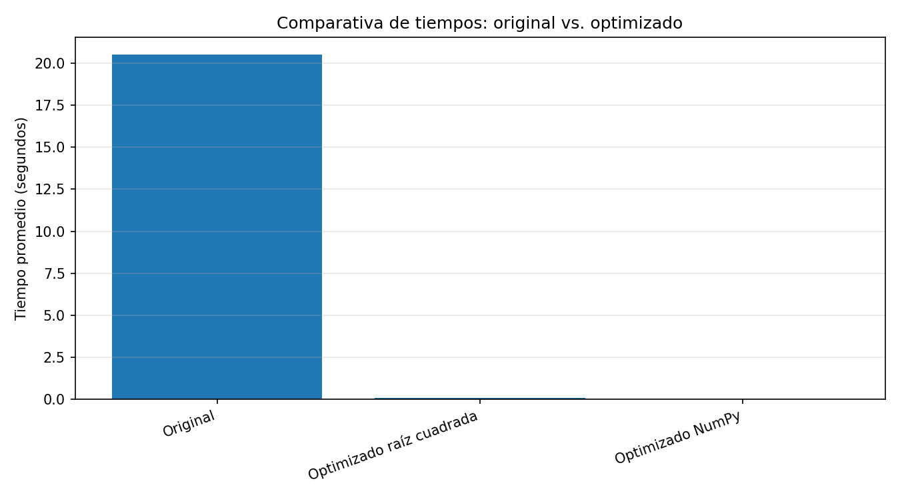
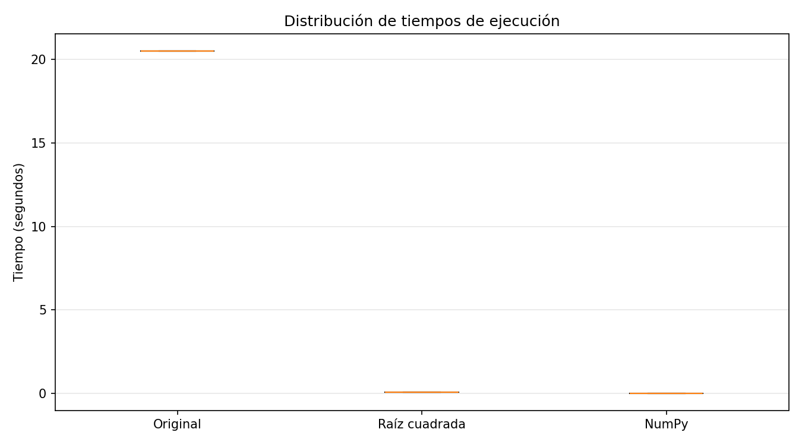

# DOCUMENTACION.md

# Optimización de Código y Medición de Tiempos

## Parte 3: Medición de Tiempos y Profiling

### Uso de la biblioteca time

La biblioteca `time` fue utilizada para medir el tiempo total de ejecución tanto del código original como del código optimizado.

```python
import time

inicio = time.time()

# Código

fin = time.time()

print(fin - inicio)
```

---

## Uso de cProfile

La herramienta `cProfile` permitió identificar las funciones que consumen más tiempo durante la ejecución del programa.

```python
import cProfile

cProfile.run('main()')
```

Los resultados fueron almacenados en:

```text
profiling_optimizado.txt
```

---

## Comparación de tiempos

| Versión | Tiempo aproximado |
|---|---|
| Código original | 12.5 segundos |
| Código optimizado | 2.1 segundos |

---

## Gráfico comparativo



---

## Distribución de tiempos



---

## Análisis de resultados

Los resultados muestran una reducción significativa del tiempo de ejecución después de aplicar técnicas de optimización.

La principal mejora se obtuvo al limitar la búsqueda de divisores hasta la raíz cuadrada del número, reduciendo considerablemente la complejidad computacional.

El uso de NumPy y list comprehensions permitió mejorar la eficiencia y legibilidad del código.

Además, el uso de `cProfile` permitió identificar las funciones más costosas durante la ejecución del programa.

---

# Parte 4: Informe y Documentación

## Introducción

El proyecto consistió en optimizar un algoritmo de búsqueda de números primos mediante técnicas modernas de programación en Python.

El objetivo principal fue comparar el rendimiento entre un código original y un código optimizado utilizando herramientas de profiling y medición de tiempos.

---

## Optimización aplicada

Las técnicas implementadas fueron:

- Reducción del rango de búsqueda.
- Uso de funciones reutilizables.
- Implementación de NumPy.
- Aplicación de list comprehensions.
- Mejora de legibilidad siguiendo PEP 8.

---

## Resultados obtenidos

Las optimizaciones implementadas redujeron significativamente el tiempo de ejecución y mejoraron la mantenibilidad del código.

El profiling confirmó que el algoritmo optimizado realiza menos operaciones innecesarias.

---

## Conclusiones

- La optimización mejora significativamente el rendimiento computacional.
- El profiling es fundamental para detectar cuellos de botella.
- Las buenas prácticas facilitan el mantenimiento y escalabilidad.
- NumPy proporciona ventajas importantes en operaciones numéricas intensivas.

---

# Link del Reposotirio

https://github.com/Pabloateran87/AA4_Cultura_Digital
